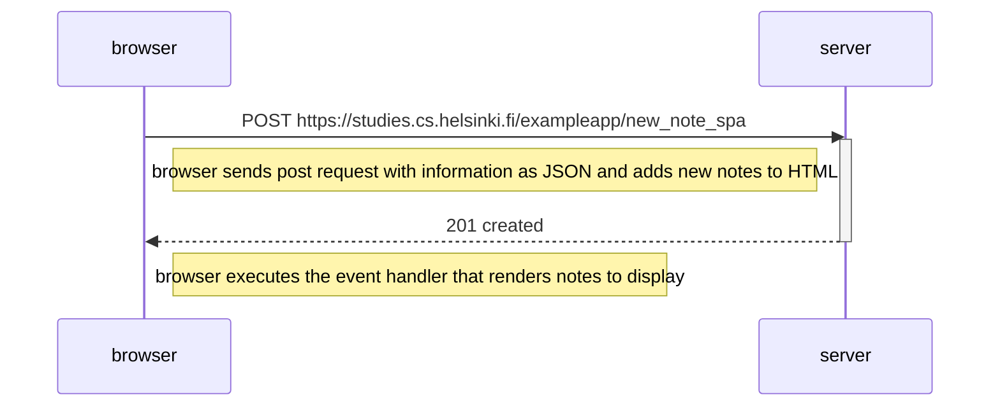

```mermaid
sequenceDiagram
    participant browser
    participant server

    browser->>server: POST https://studies.cs.helsinki.fi/exampleapp/new_note_spa
    activate server
    Note right of browser: browser sends post request with information as JSON and adds new notes to HTML
    server-->>browser: 201 created
    deactivate server
    Note right of browser: browser executes the event handler that renders notes to display

```
